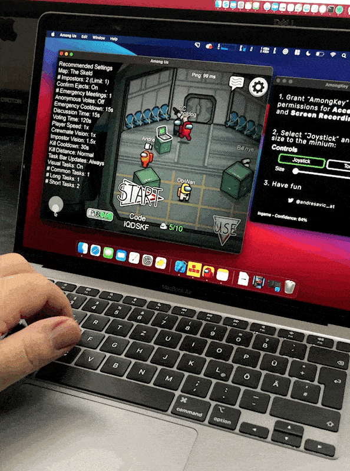

# AmongKey
Keyboard controls for Among Us on Apple Silicon Macs

## About The Project

AmongUs got featured on the last #AppleEvent for the new Macs with Apple Silicon. Steve Jobs himself would turn in his grave if he knew how horrible the UX of Among Us is on M1 Macs. You can only control the game with touch👆🏼, but there are no touch screens on Mac. 

So I created AmongKey!  

AmongKey uses the Neural Engine of the M1 processor to recognize the current gamestate and translates keyboard input signals into mouse events matching the current situation. The ML model is trained on over 1300 screenshots of Among Us gameplays.

Yes, it is a hacky workaround(and a very funny side project)... but until the makers of Among Us will implement official keyboard support, you can enjoy Among Us like on a Window machine.

## Why ML for such a simple task?

Among Us is heavily based on the ingame chat during the game. So in one second you are run through the spaceship and in the next second you have to chat with your crewmates.
The chat on the Among Us mobile version is on the Mac even more broken, because you have to manually focus the inputfield and Return to send the message is not supported.

Keepiing the keymapping static would be a very bad UX because the mouse cursor would always jump on the screen when you are typing(W A S D Space).

My first tries used simple color checking of specific UI elements. But after testing there was so many game situations in which this not worked out very good or the 
effort was way to large to catch all edge cases. For example specific tasks(security cameras) or emergency crisis tints the whole screen red. Even color values changed when chaching the screen resolution.

After over 15 ML model generation and collecting(playing the game 🤓) a lot of training data the results are very reliable. Even for game situations that the model was not trained on. Just mindblowing. 🤯

## Train the Machine Learning Model

Download the Trainig Data: 
https://drive.google.com/drive/folders/1VP8d5Rle5NWI-30EeXDdZ-mcO3Q3CSVI

Follow the instructions on:
https://developer.apple.com/documentation/createml/creating_an_image_classifier_model